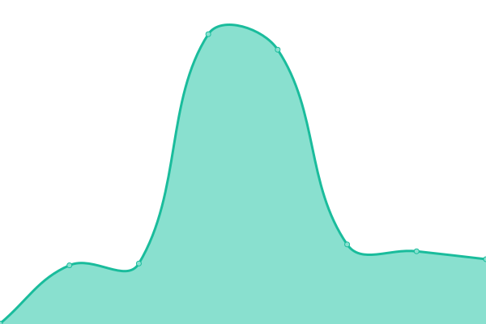
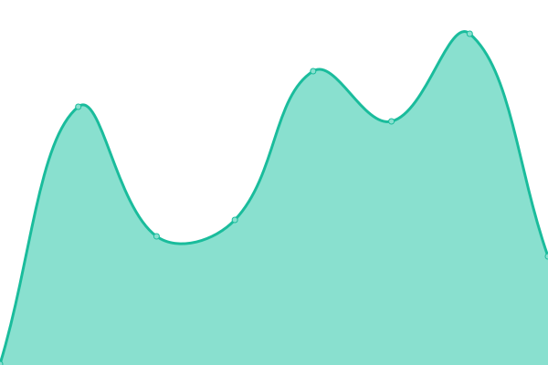
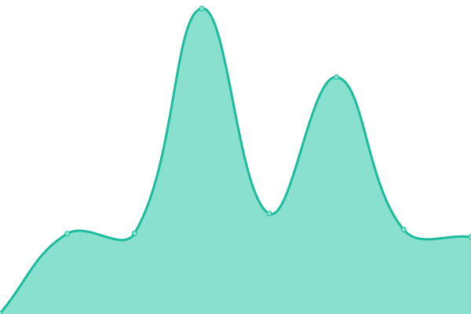
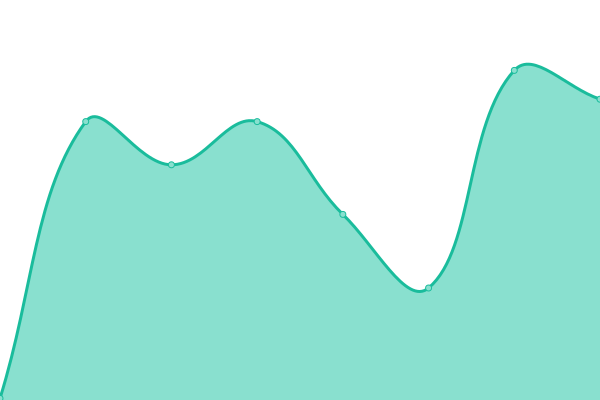

# [📈 Live Status](https://Pradumnasaraf.github.io/Monitoring): <!--live status--> **🟧 Partial outage**

This repository contains the open-source uptime monitor and status page for [Pradumna Saraf](https://www.pradumnasaraf.dev), powered by [Upptime](https://github.com/upptime/upptime).

With [Upptime](https://upptime.js.org), you can get your own unlimited and free uptime monitor and status page, powered entirely by a GitHub repository. We use [Issues](https://github.com/Pradumnasaraf/Monitoring/issues) as incident reports, [Actions](https://github.com/Pradumnasaraf/Monitoring/actions) as uptime monitors, and [Pages](https://Pradumnasaraf.github.io/Monitoring) for the status page.

<!--start: status pages-->
<!-- This summary is generated by Upptime (https://github.com/upptime/upptime) -->
<!-- Do not edit this manually, your changes will be overwritten -->
<!-- prettier-ignore -->
| URL | Status | History | Response Time | Uptime |
| --- | ------ | ------- | ------------- | ------ |
|  [Pradumna's Website](https://pradumnasaraf.dev) | 🟩 Up | [pradumna-s-website.yml](https://github.com/Pradumnasaraf/Monitoring/commits/HEAD/history/pradumna-s-website.yml) | 

 264ms
     
 | 

<a href="https://Pradumnasaraf.github.io/Monitoring/history/pradumna-s-website">98.17%</a>
    

|  [Pradumna's Newsletter](https://newsletter.pradumnasaraf.dev) | 🟥 Down | [pradumna-s-newsletter.yml](https://github.com/Pradumnasaraf/Monitoring/commits/HEAD/history/pradumna-s-newsletter.yml) | 

 224ms
     
 | 

<a href="https://Pradumnasaraf.github.io/Monitoring/history/pradumna-s-newsletter">100.00%</a>
    

|  [Pradumna's Blog (Hashnode)](https://blog.pradumnasaraf.dev) | 🟥 Down | [pradumna-s-blog-hashnode.yml](https://github.com/Pradumnasaraf/Monitoring/commits/HEAD/history/pradumna-s-blog-hashnode.yml) | 

 279ms
     
 | 

<a href="https://Pradumnasaraf.github.io/Monitoring/history/pradumna-s-blog-hashnode">100.00%</a>
    

|  [Pradumna's Photography](https://os.pradumnasaraf.dev) | 🟩 Up | [pradumna-s-photography.yml](https://github.com/Pradumnasaraf/Monitoring/commits/HEAD/history/pradumna-s-photography.yml) | 

 218ms
     
 | 

<a href="https://Pradumnasaraf.github.io/Monitoring/history/pradumna-s-photography">98.28%</a>
    

|  [DevOps](https://devops.pradumnasaraf.dev) | 🟩 Up | [dev-ops.yml](https://github.com/Pradumnasaraf/Monitoring/commits/HEAD/history/dev-ops.yml) | 

 204ms
     
 | 

<a href="https://Pradumnasaraf.github.io/Monitoring/history/dev-ops">98.28%</a>
    

|  [Snippets](https://snippets.pradumnasaraf.dev) | 🟩 Up | [snippets.yml](https://github.com/Pradumnasaraf/Monitoring/commits/HEAD/history/snippets.yml) | 

 189ms
     
 | 

<a href="https://Pradumnasaraf.github.io/Monitoring/history/snippets">98.41%</a>
    

|  [Open API](https://opensourceapi.vercel.app) | 🟩 Up | [open-api.yml](https://github.com/Pradumnasaraf/Monitoring/commits/HEAD/history/open-api.yml) | 

 1356ms
     
 | 

<a href="https://Pradumnasaraf.github.io/Monitoring/history/open-api">100.00%</a>
    

|  [Candy Go Package](https://pkg.go.dev/github.com/Pradumnasaraf/candy) | 🟩 Up | [candy-go-package.yml](https://github.com/Pradumnasaraf/Monitoring/commits/HEAD/history/candy-go-package.yml) | 

 238ms
     
 | 

<a href="https://Pradumnasaraf.github.io/Monitoring/history/candy-go-package">100.00%</a>
    

|  [GenCLI Go Package](https://pkg.go.dev/github.com/Pradumnasaraf/gencli) | 🟩 Up | [gen-cli-go-package.yml](https://github.com/Pradumnasaraf/Monitoring/commits/HEAD/history/gen-cli-go-package.yml) | 

 114ms
     
 | 

<a href="https://Pradumnasaraf.github.io/Monitoring/history/gen-cli-go-package">100.00%</a>
    

|  [BioLink](https://links.pradumnasaraf.dev) | 🟥 Down | [bio-link.yml](https://github.com/Pradumnasaraf/Monitoring/commits/HEAD/history/bio-link.yml) | 

 225ms
     
 | 

<a href="https://Pradumnasaraf.github.io/Monitoring/history/bio-link">100.00%</a>
    

|  [rebase media website](https://rebasemedia.com) | 🟩 Up | [rebase-media-website.yml](https://github.com/Pradumnasaraf/Monitoring/commits/HEAD/history/rebase-media-website.yml) | 

 113ms
     
 | 

<a href="https://Pradumnasaraf.github.io/Monitoring/history/rebase-media-website">100.00%</a>
    

<!--end: status pages-->

[**Visit our status website →**](https://Pradumnasaraf.github.io/Monitoring)

## 📄 License

- Powered by: [Upptime](https://github.com/upptime/upptime)
- Code: [MIT](./LICENSE) © [Pradumna Saraf](https://www.pradumnasaraf.dev)
- Data in the `./history` directory: [Open Database License](https://opendatacommons.org/licenses/odbl/1-0/)
